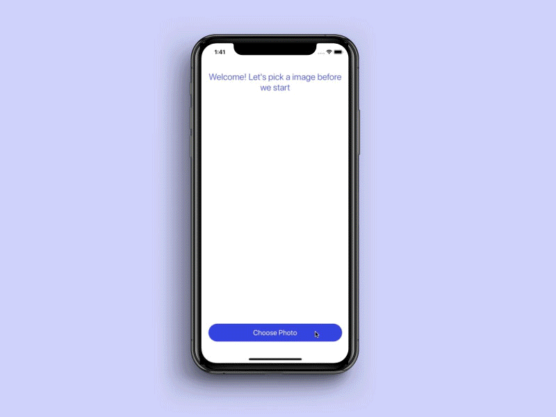

# TextRecognition
Text recognition with Apple Vision framework



Hi everyone! I would like to share a feature that app can recognize texts from image with using Apple’s Vision framework. Let’s get start.

 # Example: 
 To run the project, you will only need the download the clone project. It’s ready to run.

# Requirements: 
iOS 11.0+ , Xcode 8+

# Usage: 
You will need to import “Vision” framework in the target viewController first. Then you will be ready to implement the VNImageRequestHandler for text recognition from an image input.

CodeTree  {
```
func performOCR(on image: UIImage?, recognitionLevel: VNRequestTextRecognitionLevel)  {
        // We set the image in cgImage format
        guard let image = image?.cgImage else { return }
        // And we define the Vision ImageRequestHandler
        let requestHandler = VNImageRequestHandler(cgImage: image, options: [:])
        // Then we define the Vision Text recognition request with error handling parameters
        let request = VNRecognizeTextRequest  { (request, error) in
            // Error handling
            if let error = error {
                print(error)
                return
            }
            // 'Observations' are the all rows that recognized texts and we store them in '[VNRecognizedTextObservation]' array
            guard let observations = request.results as? [VNRecognizedTextObservation] else { return }
            // We start a for loop for handling the every line of observed texts and we set them into our 'finalTextForSpeech' input
            for currentObservation in observations {
                let topCandidate = currentObservation.topCandidates(1)
                if let recognizedText = topCandidate.first {
                    // NOTE: TextRecognition performs until no textLine left to observe. So we use '+=' operator to store every text line that we observed
                    self.finalTextForSpeech += recognizedText.string
                }
                
            }
            // Print for debugging
            print(self.finalTextForSpeech)
            // Activity indicator for process
            self.activityIndicator.stopAnimating()
            
        }
        // Request's 'TextRecognition' recognition level (Accurate and Fast)
        request.recognitionLevel = recognitionLevel
        // Performing the TextRecognition request
        try? requestHandler.perform([request])
    }
```
}

# Author: 
Oktay Kurt / kurt21380@gmail.com

# License: 
Built-in feature, No license
